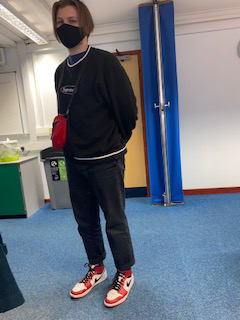

Fashion has become a huge part of our daily lives and continues to evolve time and time again. In this current day and age, fashion has diverged into many fields and each component has developed its own importance, for example, sneakers.

 To be very direct, there is one type of sneakers that is seen as 'a classic that evokes nostalgia and connects generations.’ The Air Jordans. These unique trainers have quickly turned into a storm of a trend but some people forget its rich history and as to why it is trending now. <https://www.theringer.com/nba/2020/5/4/21246027/air-jordan-1-nike-michael-jordan-sneaker-king-legacy-the-last-dance> 12.10.21

 Shoes were just shoes a long time ago until Nike released a pair of basketball shoes. It was at that moment the Air Jordans were made. Michael Jordan and his first shoes were released in April 1985, however, the NBA banned the Jordan 1's. 'Commissioner David Stern banned a similar black and red shoe that predated the Air Jordan 1 for violating the leagues' uniform policy.' [pudding.cool/2018/09/jordans/](pudding.cool/2018/09/jordans/) 12.10.21

What people have also recognized are the two different Jordan logos that appear on the sneakers. One of them is the iconic silhouette of Michael Jordan leaping in the air, but there is another one that appears on the side of the sneakers which consists of wings. These were flight inspired in order to signify his 'airborne endorsement'

Nike even went so far as to produce wings logo pins as a novelty to tie in with the aviation concept. This sense of narrative was carried over into the print commercials that featured Michael Jordan on a runaway, leveraging Moore's experience designing overtly thematic posters.

It is safe to say that Air Jordan 1's are one of the most popular sneakers right now and what is so amazing about them is that there are multiple versions to discover and try on. Over 100 different versions were produced in the last decade. My good friend Harry, in the photo above,  easily displays how great the Air Jordans look and how they complement the rest of your outfit. For example, the red, white, and black sneakers correspond with his jumper. 

Furthermore, many celebrities are following the trend and wearing the Air Jordans that suit their style. Not only has this trend reached out to the celebrity eye but all the basketball lovers have also adopted this trend which firstly expresses their passion for the sport and secondly unintentionally advertises the branding in the real world.

A further point that needs to be made is that there are now different sneaker shapes that fit the consumer's personal style. The three shapes to choose from are low, mid, and high. Everyone has their own preference but the low Jordans can be viewed as quite similar to the air forces.

As a whole, the typography of the Air Jordan logos, as well as the sneakers' evolution holds a huge amount of depth when it comes to its meaning and rich history and this could be seen as one of the many reasons why it has become such a popular trend now.

Let me know what you think in the comments section.