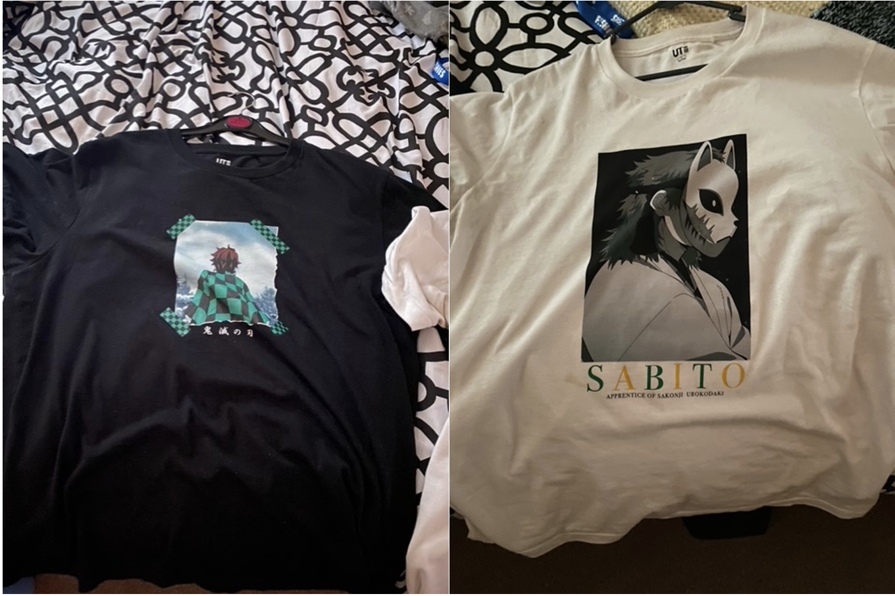

The world of Anime is very complex and as each day passes, more and more people are trying it out and end up getting hooked on it. There are countless anime shows that interest a wide-ranged audience. Some see anime to be a childish concept that is no different from normal cartoons, but others have acknowledged anime and even let it become a huge part of their lives.  Even now, anime has become such a trendy genre that people are starting to show their love for it through clothing.

In the past years, anime was just something to be watched and admired, but now it has become a great opportunity and an amazing idea for conglomerates to utilise and one of these great ideas is to combine certain animes and clothing together. An example of this is in the picture above which consists of a black top that has a character from the Dragon Ball super anime which is considered to be one of the greatest animes of all time.<https://reelrundown.com/animation/top-10-most-popular-anime-of-all-time>

Furthermore, the shirt displayed is unique in the sense that it shares the same typeface as the Los Angeles Lakers basketball team. This is done in order to widen their target audience for both basketball and dragon ball fans.

## Demon Slayer

Demon Slayer is considered to be one of the greatest new generation animes and has risen greatly in terms of popularity and success. The storyline consists of a young boy named Tanjirou and in the first episode, his family is consumed by hideous creatures know as demons. In addition, his sister has also been turned into a demon but she is still aware of herself and has not lost control. Tanjirou sets out on a journey to turn his sister, the only survivor in his family, back to human. The black shirt in the image above shows the view of the protagonist (Tanjirou) from behind. The white shirt displays another character from the series.

Many anime lovers decide to wear clothes like the ones above since the typography and design are completely unique and differ from everyone else's attire. The Japanese symbols and the logos of the anime itself are usually shown on the clothing which on its own stands out from everything else.

## Why anime?

The unique ability of anime to develop with its viewers is one of the key reasons why it has stood out from the rest and increased in popularity around the world. As a result, anime creators have begun to create content that caters to western preferences, as well ass producing anime in other countries where labour costs are low.

Furthermore, many anime series tend to have better narratives than cartoons. This also links to how anime is very well known for its strong relatable characters. With the audience being able to relate to the characters, a sense of understanding and acceptance is created equally between the viewers.

Let me know what your opinions are!