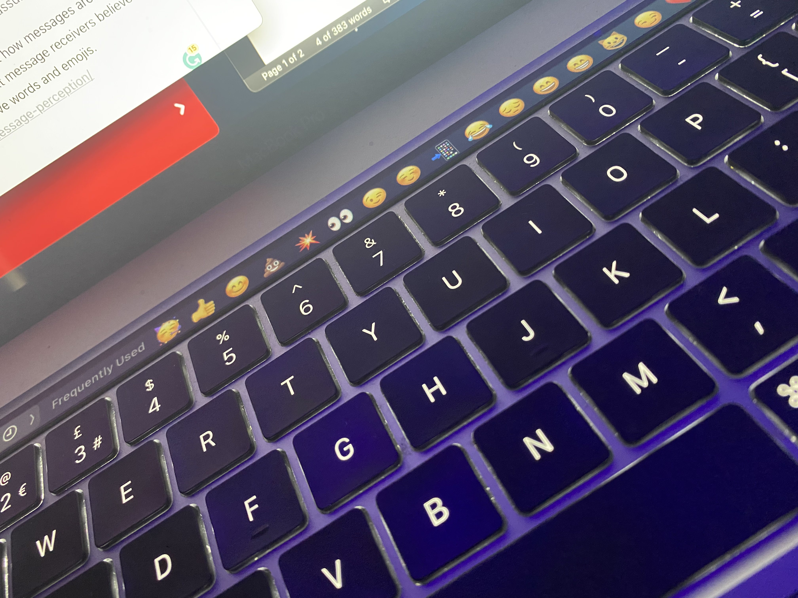

# **😊The Power of Emojis😉**

Emojis have become an iconic and recurring aspect of our daily lives and have changed the way people communicate. Not only has it made texting much more interesting, but it also adds value to other things as well as describing or displaying complicated messages. 📲

A set of 176 emojis for mobile phones and pagers was produced by NT Docomo, a Japanese cell phone carrier, in 1999. Emoji is a combination of the terms "picture" and "letter" in Japanese. The fact that the term "emoji" sounds like it was developed from the English word "emotion" is merely an odd coincidence.

On November 1, 1997, Soft Bank, then known as J-phone, debuted the Skywalker DP-211SW mobile phone, which had the world's first known emoji set. The collection compromises 90 different emoji characters, including the poo emoji 💩 , which is one of the most well-known in the Unicode Standard.

Over the years, the use of emojis has become much more popular and keep increasing as more people text, tweet, post etc. Research from <https://blog.emojipedia.org/emoji-trends-that-defined-2020/> states that 'Emoji use continues to rise with over one in five tweets now containing at least one emoji. While more emojis are being used now than ever, the rate of growth has slowed in 2020.'

Emoji usage on Twitter has continued to rise this year, with an average of 20.5 percent of messages evaluated in December 2020 including at least one emoji.

The year 2020 began with an average of 18.69 percent of tweets featuring at least one emoji, but by June, the average had risen to and remained above 20% for the rest of the year.

This development follows a pattern identified by Emjipedia earlier this year, in which emoji usage on Twitter has been continuously increasing for several years.

## 💥The Emoji Impact👀

Emojis have been with us for a very long time and during this period, certain emojis have had their meanings altered, and now, when people see these emojis with a message or on social media, they interpret them differently. This is very similar to the theory of signs and signifiers by Ferdinand de Saussure.

Studies from the University of Ottawa found that emojis hold the power to impact how messages are interpreted, 'regardless of the sender's intentions.' According to the study, text message receivers believe negative words and emoticons have a greater emotional impact than positive words and emojis. <https://thefulcrum.ca/sciencetech/u-of-o-finds-emojis-impact-text-message-perception/>

