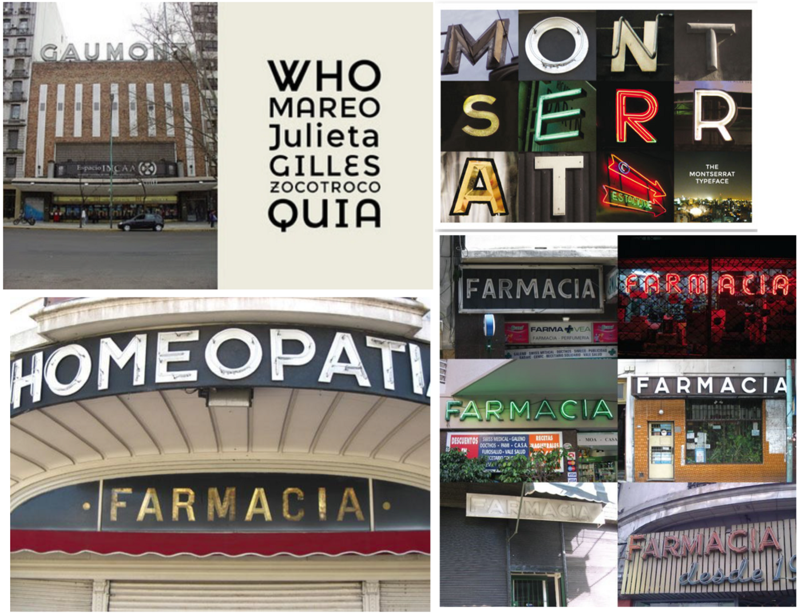

Many of you may know Montserrat as the mountainous Caribbean island, but Montserrat is also a sans-serif typeface designed by Argentinian designer Julieta Ulanovsky. The creation of this font all started with a project that she began in 2010 called 'The Montserrat Font Project'. She did this as a post-graduate student of typeface design at the FADU, university of Buenos Aires. In order to complete the first public release and share it with the world through Google Fonts, she launched it as a Kickstar project in 2011.

Julia Ulnavosky was inspired by the signs and old posters found in the historical Montserrat neighbourhood of Buenos Aires. 'She wanted to design a typeface that rescues the beauty of urban typography from the first half of the twentieth century. The Montserrat typeface draws on rich history of craftsmanship and local knowledge to combine and preserve in a new, open source free typeface ready for use in the most modern environments.' <https://medium.com/@jocelync12005/montserrat-a-ui-case-study-for-a-typographical-specimen-8eb169b1aa65>

Montserrat is frequently referred to as the most cost-effective option to Gotham and Proxima Nova, however others may disagree and state that it is a more unique typeface due to the uppercase G A and J which sets it apart. Q has a distinct tail whilst the J has a crossbar at the top of the letter. In addition to it being a sans serif, it also consists of 18 styles and 9 weights.

Montserrat is a very adaptable font that may be used in a variety of contexts, including websites, publishing, editorial, logos, print, posters and so on. It's a typeface that, because of its geometric and aesthetic simplicity and large x-height, can be used almost anyplace.

Julieta talks about her font and says "*As urban development changes this place, it will never return to its original form and loses forever the designs that are so special and unique. To draw the letters, I rely on examples of lettering in the urban space. Each selected example produces its own variants in length, width and height proportions, each adding to the Montserrat family. The old typographies and canopies are irretrievable when they are replaced.*

*There are other revivals, but those do not stay close to the originals. The letters that inspired this project have work, dedication, care, color, contrast, light and life, day and night! These are the types that make the city look so beautiful."* <http://dcdesignhouse.ca/behold-montserrat/>

Through this description, it is easy to grasp Julieta's intentions for creating this font and now her approach is known worldwide and used in many platforms, from posters to multiple websites.